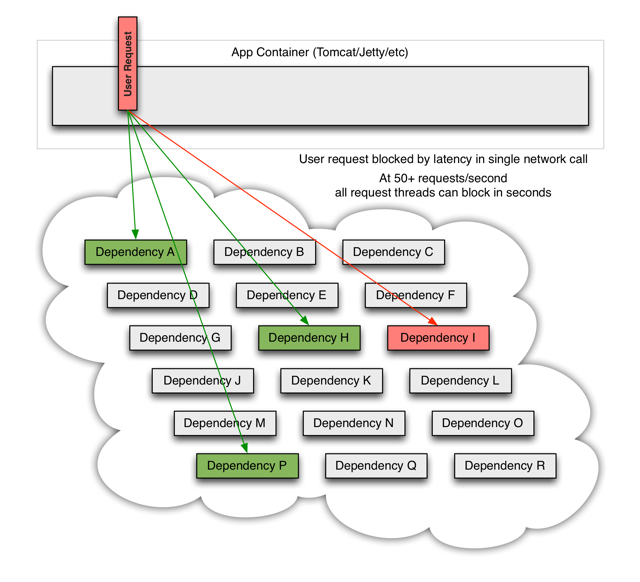
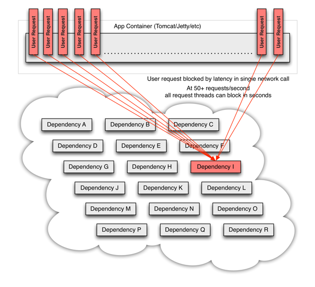
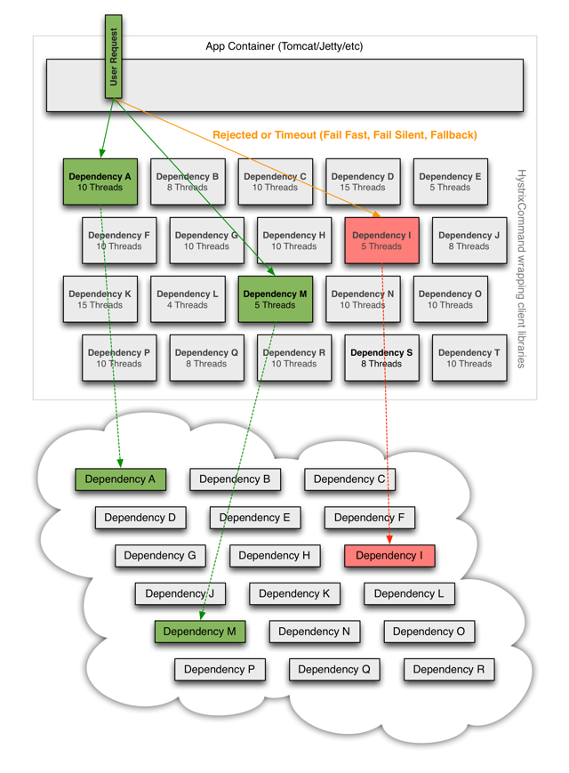

#Hystrix

##Hystrix是什么
在分布式环境中，许多服务依赖项中的一些必然会失败。Hystrix是一个库，通过添加延迟容忍和容错逻辑，帮助你控制这些分布式服务之间的交互。Hystrix通过隔离服务之间的访问点、停止级联失败和提供回退选项来实现这一点，所有这些都可以提高系统的整体弹性。

##Hystrix为了什么
Hystrix被设计的目标是：

1. 对通过第三方客户端库访问的依赖项（通常是通过网络）的延迟和故障进行保护和控制。
2. 在复杂的分布式系统中阻止级联故障。
3. 快速失败，快速恢复。
4. 回退，尽可能优雅地降级。
5. 启用近实时监控、警报和操作控制。

复杂分布式体系结构中的应用程序有许多依赖项，每个依赖项在某些时候都不可避免地会失败。如果主机应用程序没有与这些外部故障隔离，那么它有可能被他们拖垮。
当一切正常时，请求看起来是这样的:

当其中有一个系统有延迟时，它可能阻塞整个用户请求：

在高流量的情况下，一个后端依赖项的延迟可能导致所有服务器上的所有资源在数秒内饱和（PS：意味着后续再有请求将无法立即提供服务）

#Hystrix设计原则是什么
* 防止任何单个依赖项耗尽所有容器（如Tomcat）用户线程。
* 甩掉包袱，快速失败而不是排队。
* 在任何可行的地方提供回退，以保护用户不受失败的影响。
* 使用隔离技术（如隔离板、泳道和断路器模式）来限制任何一个依赖项的影响。
* 通过近实时的度量、监视和警报来优化发现时间。
* 通过配置的低延迟传播来优化恢复时间。
* 支持对Hystrix的大多数方面的动态属性更改，允许使用低延迟反馈循环进行实时操作修改。
避免在整个依赖客户端执行中出现故障，而不仅仅是在网络流量中。
#Hystrix是如何实现它的目标的
* 用一个HystrixCommand 或者 HystrixObservableCommand （这是命令模式的一个例子）包装所有的对外部系统（或者依赖）的调用，典型地它们在一个单独的线程中执行
* 调用超时时间比你自己定义的阈值要长。有一个默认值，对于大多数的依赖项你是可以自定义超时时间的。
* 为每个依赖项维护一个小的线程池(或信号量)；如果线程池满了，那么该依赖性将会立即拒绝请求，而不是排队。
* 调用的结果有这么几种：成功、失败（客户端抛出异常）、超时、拒绝。
* 在一段时间内，如果服务的错误百分比超过了一个阈值，就会触发一个断路器来停止对特定服务的所有请求，无论是手动的还是自动的。
* 当请求失败、被拒绝、超时或短路时，执行回退逻辑。
* 近实时监控指标和配置变化。
* 当你使用Hystrix来包装每个依赖项时，上图中所示的架构会发生变化，如下图所示：

每个依赖项相互隔离，当延迟发生时，它会被限制在资源中，并包含回退逻辑，该逻辑决定在依赖项中发生任何类型的故障时应作出何种响应：
